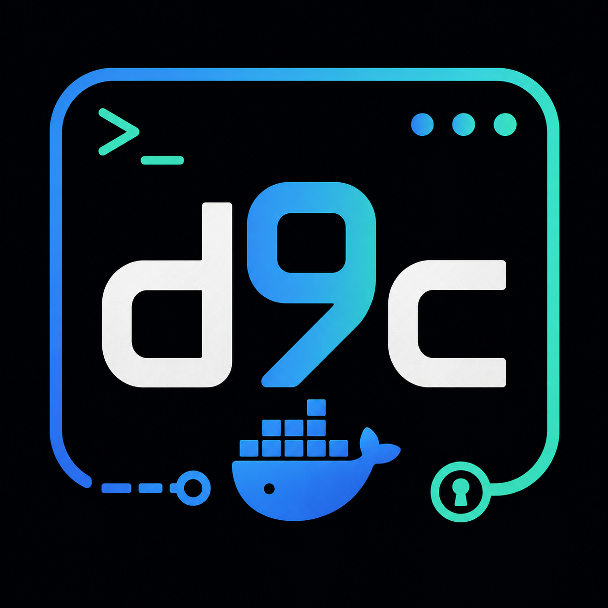
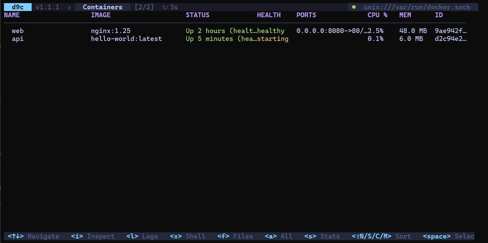

<p align="center">
  
</p>

# d9c

**Терминальный (TUI) менеджер Docker для удалённого хоста** — в духе [`k9s`](https://k9scli.io/)
и [`lazydocker`](https://github.com/jesseduffield/lazydocker), но сфокусированный на управлении
Docker **по TCP или SSH**. Один бинарник, без агентов на удалённой стороне: подключаетесь к демону,
видите контейнеры, образы, сети, тома и Compose-проекты и управляете ими, не выходя из терминала.

Собран на [Bubble Tea](https://github.com/charmbracelet/bubbletea) и официальном
[Docker SDK](https://pkg.go.dev/github.com/docker/docker).


[](https://dalink.to/kirg08)

<p align="center">
  
</p>

> Хотите посмотреть без настройки Docker? Запустите демо на фейковых данных:
> `go run . -demo`.

---

## Содержание

- [Возможности](#возможности)
- [Установка](#установка)
- [Быстрый старт](#быстрый-старт)
- [Подключение к Docker](#подключение-к-docker)
- [Разделы и навигация](#разделы-и-навигация)
- [Фильтр `/`](#фильтр-)
- [Конфиг, темы и клавиши](#конфиг-темы-и-клавиши)
- [Файловая система контейнера](#файловая-система-контейнера-f--files)
- [Автообновление](#автообновление)
- [Алерты по порогам ресурсов](#алерты-по-порогам-ресурсов)
- [Плагины](#плагины)
- [Разработка](#разработка)
- [Поддержать проект](#поддержать-проект)
- [Лицензия](#лицензия)

---

## Возможности

- **Удалённый Docker по TCP и SSH** — один путь подключения для обоих транспортов, живой
  `:connect`, сохранённые хосты с CRUD, автореконнект при разрыве (backoff + баннер).
- **Все основные ресурсы** — Containers / Images / Networks / Volumes / Compose / Hosts.
- **Управление, а не только просмотр** — start/stop/restart/kill/rm, массовые операции
  (множественный выбор `Space` — bulk-операции над контейнерами и удаление образов),
  `run`-мастер, создание сетей/томов, `build`/`tag`/`push`
  (в т. ч. в приватный реестр), `docker system df` и `prune` с подтверждением.
- **Compose** — discovery по меткам, `up`/`pull`/`down` со стримингом, `config`, `edit`,
  `create`, бэкап/восстановление, логи проекта, drill-down в контейнеры (операции с файлами
  проекта и запуском `docker compose` — только по SSH; см. [Подключение к Docker](#подключение-к-docker)).
- **Логи и метрики** — `--tail/--since/--until`, поиск, сохранение в файл; живые CPU/MEM/Net/Disk
  через Stats API.
- **Встроенный терминал** — интерактивный `exec` в контейнер (vt10x-эмулятор), один путь для
  TCP и SSH.
- **Обзор файловой системы контейнера** — навигация и `docker cp` в обе стороны.
- **Живой журнал событий демона** (`docker events`) отдельной консолью.
- **Мульти-хост дашборд** — статус и агрегаты (`docker info`) по всем сохранённым хостам.
- **Алерты по CPU/MEM**, настраиваемые **темы** и **горячие клавиши**, **плагины** (свои команды
  и клавиши из YAML — как в k9s).

---

## Установка

### Готовые бинарники (рекомендуется)

Не нужны ни Go, ни компилятор — на удалённом хосте тоже ничего ставить не надо.
Скачайте архив под свою ОС со страницы
[**Releases**](https://github.com/kirg0/d9c/releases/latest):

| ОС | Файл |
|----|------|
| Linux (x86-64) | `d9c_vX.Y.Z_linux_amd64.tar.gz` |
| Linux (ARM64) | `d9c_vX.Y.Z_linux_arm64.tar.gz` |
| macOS (Intel) | `d9c_vX.Y.Z_darwin_amd64.tar.gz` |
| macOS (Apple Silicon) | `d9c_vX.Y.Z_darwin_arm64.tar.gz` |
| Windows (x86-64) | `d9c_vX.Y.Z_windows_amd64.zip` |

Внутри архива — один исполняемый файл (`d9c` или `d9c.exe`) плюс `README.md` и `LICENSE`.

**Linux / macOS:**

```sh
# распаковать и поставить в PATH (пример для Linux amd64)
tar -xzf d9c_vX.Y.Z_linux_amd64.tar.gz
sudo install d9c_vX.Y.Z_linux_amd64/d9c /usr/local/bin/d9c

d9c -version          # проверить
```

> macOS может заблокировать неподписанный бинарник при первом запуске
> («cannot be opened because the developer cannot be verified»). Снимите карантин:
> `xattr -d com.apple.quarantine ./d9c`.

**Windows (PowerShell):**

```powershell
# распакуйте zip и запускайте d9c.exe из этой папки,
# либо положите его в каталог из %PATH%
Expand-Archive d9c_vX.Y.Z_windows_amd64.zip
.\d9c_vX.Y.Z_windows_amd64\d9c.exe -version
```

**Проверка контрольной суммы (необязательно).** К каждому релизу приложен
`checksums.txt` (SHA-256):

```sh
sha256sum -c checksums.txt 2>/dev/null | grep d9c_vX.Y.Z_linux_amd64.tar.gz
```

```powershell
# Windows
(Get-FileHash .\d9c_vX.Y.Z_windows_amd64.zip -Algorithm SHA256).Hash
```

### Сборка из исходников

Нужен [Go 1.25+](https://go.dev/dl/):

```sh
git clone https://github.com/kirg0/d9c.git
cd d9c
make build          # бинарник ./d9c (или d9c.exe на Windows)
```

или напрямую через `go`:

```sh
go build -o d9c .
```

Версию можно зашить в бинарник при сборке (релизные сборки делают это автоматически):

```sh
go build -ldflags "-X d9c/internal/version.Version=1.2.3" -o d9c .
```

Приложение следует [SemVer](https://semver.org); текущая версия показана в шапке (`d9c vX.Y.Z`)
и печатается флагом `-version`.

---

## Быстрый старт

```sh
go run . -demo                 # демо-данные, без Docker
go run . -H tcp://host:2375    # удалённый демон по TCP
go run . -H ssh://user@host    # удалённый демон по SSH-туннелю
go run . -version              # вывести версию и выйти
```

> Примеры выше — для запуска из исходников. Если вы поставили готовый бинарник,
> используйте `d9c` вместо `go run .` (например, `d9c -demo`, `d9c -H ssh://user@host`).

Если хост не указан, d9c открывается на разделе **Hosts**, где можно выбрать сохранённый хост
или добавить новый — подключение произойдёт по `Enter` / `:connect`.

---

## Подключение к Docker

| Транспорт | Пример | Примечание |
| --- | --- | --- |
| TCP | `-H tcp://host:2375` | демон должен слушать TCP (`-H tcp://0.0.0.0:2375` на стороне сервера) |
| SSH | `-H ssh://user@host` | туннель по SSH к локальному сокету демона; ключи из агента/`~/.ssh` |

> **TCP против SSH — что доступно.** Почти всё (контейнеры, образы, сети, тома, exec,
> обзор ФС контейнера, события, дашборд) работает по обоим транспортам через Docker Engine API.
> Но операции Compose, которым нужен доступ к **файловой системе хоста** или запуск самого
> `docker compose` как процесса, идут мимо API — только через SSH. Поэтому **при подключении по
> TCP следующие команды Compose недоступны** (они не показываются ни в подсказках, ни в `?`):
> `create`, `up`, `down`, `pull`, `config`, `edit`, `backup`, `restore` (и клавиша `e` — правка
> файла). По TCP остаются discovery проектов, просмотр/инспекция/логи, локальный каталог
> `backups` (только просмотр и удаление архивов — восстановление требует SSH) и управление
> контейнерами проекта: `start` / `stop` / `restart` / `pause` / `unpause` / `remove`. Нужен
> полный набор Compose — подключайтесь через `-H ssh://...`.

Раздел **Hosts** — это и список сохранённых хостов, и мульти-хост дашборд: на каждый хост строка
со статусом (● up/down) и агрегатом из `docker info` (контейнеры/запущено/образы/версия демона).
Данные собираются по одному соединению на хост, обновляются раз в ~10 секунд. `Enter` — подключиться
к выбранному хосту. Управление прямо из раздела: `a` — добавить, `e` — редактировать, `d` — удалить
(с подтверждением); те же действия доступны командами `:add` / `:edit` / `:rm`. Команды
`:dashboard` / `:dash` — алиасы для `:hosts`.

---

## Разделы и навигация

Разделы: **Containers / Images / Networks / Volumes / Compose / Hosts**.

- Навигация — стрелками / `j` / `k`, `PgUp/PgDn`, `g`/`G`.
- Фильтр — `/`, командная строка — `:`, выход — `q`.
- Подсказки клавиш — в нижней строке, полная справка по текущему разделу — по клавише `?`.

---

## Фильтр `/`

Простой текст — подстрока без учёта регистра (несколько слов — логическое И).
Доступны и структурированные термины (для Containers — самые полные):

| Терм | Что делает |
| --- | --- |
| `nginx` | подстрока в имени/образе/статусе |
| `re:^web-\d+` | регулярное выражение (без регистра) |
| `status:running` | по статусу/состоянию (`running`, `exited`, `healthy`…) |
| `label:env` / `label:env=prod` | по метке контейнера (ключ или ключ=значение) |
| `network:frontend` (`net:`) | по подключённой сети |

Термины комбинируются через пробел (И): `status:running label:env=prod net:bridge`.
Ошибка в регулярном выражении подсвечивается прямо в строке фильтра.

---

## Конфиг, темы и клавиши

Цветовая схема и горячие клавиши настраиваются в YAML-конфиге. По умолчанию d9c ищет файл
**`d9c-config.yaml` рядом с исполняемым файлом**; другой путь — флагом:

```sh
d9c -config /path/to/d9c-config.yaml
```

Если файла нет — это не ошибка, берётся встроенная тема `tokyonight`. Файл читается
**один раз при запуске**: после правки перезапустите d9c.

```yaml
theme: dracula            # встроенная палитра (по умолчанию tokyonight)
colors:                   # необязательные точечные переопределения цветов
  primary: "#ff79c6"
  danger: "#ff5555"
```

Встроенные темы: `tokyonight`, `dracula`, `nord`, `gruvbox`, `solarized`,
`catppuccin`. Тему можно переключить и **на лету, без конфига** — командой
`:theme <name>` (например `:theme nord`); `:theme` без аргумента покажет список
тем и текущую. Переключение действует до перезапуска; постоянная тема задаётся в
конфиге. В `colors` можно переопределить любой из базовых цветов поверх выбранной
темы:

| Ключ | Назначение |
| --- | --- |
| `primary` | акценты, активные клавиши, индикаторы |
| `secondary` | заголовки таблиц, метки |
| `success` | running / healthy / «● up» |
| `warning` | переходные состояния (paused, реконнект) |
| `danger` | ошибки, stopped, unhealthy |
| `muted` | приглушённый текст, разделители |
| `bg` / `bgalt` | фон и приподнятые поверхности (выделение, бары, модалки) |
| `fg` | основной текст |
| `border` | рамки и линии |

Значение цвета — hex (`#rgb` или `#rrggbb`) либо индекс ANSI-палитры `0`–`255`.
Неизвестная тема, неизвестный ключ цвета или некорректное значение — ошибка при
старте (`loading config: …`).

### Клавиши

Действия normal-режима можно переназначить в секции `keys:` того же
`d9c-config.yaml`. Указываются только те действия, которые нужно изменить —
остальные остаются на значениях по умолчанию:

```yaml
keys:
  filter: f        # фильтр вместо "/"
  logs: g          # логи вместо "l"
  select: space    # отметка для массовой операции (алиас "space" = пробел)
```

| Действие | По умолчанию | Что делает |
| --- | --- | --- |
| `inspect` | `i` | подробности выбранного ресурса |
| `logs` | `l` | логи контейнера / compose-проекта |
| `edit` | `e` | редактировать compose-файл |
| `exec` | `x` | shell в контейнере (встроенный терминал) |
| `filter` | `/` | фильтр по строкам |
| `command` | `:` | командная строка |
| `toggle-all` | `a` | все / только running |
| `stats` | `s` | метрики CPU/MEM |
| `select` | `space` | отметить для массовой операции |
| `copy` | `y` | меню копирования |
| `refresh` | `r` | обновить вручную |
| `pause` | `p` | пауза/возобновление автообновления |
| `help` | `?` | справка |

Значение — имя клавиши в нотации bubbletea (`f`, `ctrl+d`, `f5`, `space` и т. п.).
Навигация (`↑/↓`, `j/k`, `PgUp/PgDn`), `Enter` и клавиши выхода (`q`, `esc`,
`Ctrl+C`) фиксированы и не переназначаются. Неизвестное действие, пустая клавиша,
зарезервированная клавиша или одна клавиша на два действия — ошибка при старте
(`loading keybindings: …`). Справка `?` показывает уже актуальные (переназначенные)
клавиши.

---

## Файловая система контейнера (`f` / `:files`)

В разделе **Containers** клавиша `f` (или команда `:files [path]`) открывает обзор
файловой системы выбранного запущенного контейнера. Листинг строится через `ls`
внутри контейнера, поэтому в минимальных образах без `ls` (scratch/distroless)
обзор недоступен (об этом сообщается понятной ошибкой).

| Клавиша | Действие |
| --- | --- |
| `enter` / `l` | войти в каталог |
| `⌫` / `h` / `-` | подняться на уровень вверх |
| `d` | скачать выбранный файл/каталог в рабочий каталог d9c (`docker cp` из контейнера) |
| `↑/↓` `j/k`, `g`/`G`, `PgUp/PgDn` | навигация по списку |
| `q` / `esc` | закрыть обзор |

Загрузка В контейнер — командой `:cp <local-path> <container-dir>` (целевой путь
должен быть существующим каталогом внутри контейнера). Скачивание распаковывает
tar-поток демона на диск с защитой от выхода за пределы каталога назначения;
символьные ссылки и спецфайлы при этом пропускаются.

---

## Автообновление

Списки обновляются по таймеру. Стартовый интервал задаётся флагом `-interval`
(например `-interval 5s`, по умолчанию `3s`); на лету его меняет команда
`:interval <dur>` (`:interval 10s`, диапазон `1s`–`1h`), а `:interval` без
аргумента показывает текущее значение. Клавиша `p` (или `:interval pause` /
`:interval resume`) ставит автообновление на паузу и снимает с неё — индикатор
статуса сервера при этом продолжает работать, а ручное обновление по `r` доступно
всегда. Состояние видно в шапке: `↻3s` — активный интервал, `⏸ paused` — пауза.

---

## Алерты по порогам ресурсов

Контейнеры, чья нагрузка превышает заданный порог, подсвечиваются маркером `⚠`
рядом с именем (в обоих режимах таблицы Containers), а в шапке появляется счётчик
`⚠ N` — число «горящих» контейнеров. Пороги опираются на живые метрики Stats API
(те же CPU%/MEM%, что в режиме `s`); остановленные и ещё не опрошенные контейнеры
не учитываются.

Стартовые пороги задаются секцией `alerts:` в `d9c-config.yaml` (необязательная;
`0` или отсутствие = метрика выключена):

```yaml
alerts:
  cpu: 80     # подсветить контейнер при CPU% ≥ 80 (может превышать 100 на многоядерных)
  mem: 90     # подсветить при MEM% ≥ 90
```

На лету пороги меняет команда `:alert`:

| Команда | Действие |
| --- | --- |
| `:alert cpu <%>` | порог по CPU% (например `:alert cpu 80`) |
| `:alert mem <%>` | порог по MEM% |
| `:alert cpu off` / `:alert mem off` | выключить отдельную метрику |
| `:alert off` | выключить алерты полностью |
| `:alert` | показать текущие пороги |

---

## Плагины

Плагины — это **пользовательские команды и горячие клавиши**, описанные в YAML-файле
(как в k9s). Каждый плагин запускает **локальную** команду (на той машине, где работает
d9c) с подстановкой данных выбранной строки. Так можно встроить `dive`, `lazydocker`,
`ctop`, собственные скрипты, `docker`-команды и т. п. — не меняя код приложения.

### Где лежит файл

По умолчанию d9c ищет файл **`d9c-plugins.yaml` рядом с исполняемым файлом**.
Другой путь можно указать флагом:

```sh
d9c -plugins-file /path/to/plugins.yaml
```

Если файла нет — это не ошибка, просто плагинов не будет. Файл читается **один раз при
запуске**: после правки перезапустите d9c.

### Формат файла

Корень — ключ `plugins` со списком объектов:

```yaml
plugins:
  - name: dive                 # обязательно — имя команды (вызов :dive)
    key: ctrl+d                # необязательно — горячая клавиша
    scope: images              # в каком разделе доступен (по умолчанию "*")
    description: Слои образа   # необязательно — для документации
    command: dive              # обязательно — исполняемый файл (без аргументов)
    args: ["${ID}"]            # необязательно — аргументы (каждый отдельной строкой)
    background: false          # необязательно — режим запуска (по умолчанию false)
```

#### Поля

| Поле          | Обяз. | Описание |
|---------------|:----:|----------|
| `name`        |  да  | Имя команды. Запускается как `:name`. |
| `command`     |  да  | Имя/путь исполняемого файла. **Запускается напрямую, без shell.** |
| `args`        | нет  | Список аргументов. Каждый — отдельный элемент списка (не одна строка). |
| `scope`       | нет  | Раздел, где плагин активен. По умолчанию `*` (везде). |
| `key`         | нет  | Горячая клавиша (формат Bubble Tea: `ctrl+d`, `f5`, `alt+x`…). |
| `description` | нет  | Краткое описание (документирующее). |
| `background`  | нет  | `false` — интерактивно (захват терминала); `true` — фоном с выводом в консоль. |

#### Допустимые значения `scope`

`containers`, `images`, `networks`, `volumes`, `compose`, `hosts`, или `*` (любой раздел).
Регистр не важен. Плагин со `scope: containers` доступен только в разделе контейнеров;
`scope: "*"` — во всех.

### Подстановка `${ПЕРЕМЕННЫХ}`

Перед запуском в `command` и в каждом элементе `args` подставляются значения из
**выделенной строки**. Неизвестные плейсхолдеры остаются как есть (чтобы опечатка была
заметна).

Доступны всегда:

| Переменная | Значение |
|------------|----------|
| `${HOST}`  | Адрес текущего Docker-хоста (`tcp://…` или `ssh://…`). |
| `${ID}`    | Идентификатор выделенной строки. Для контейнеров/образов/сетей — ID; для томов/проектов/хостов — имя (оно же ключ строки). |

В зависимости от раздела добавляются:

| Раздел (`scope`) | Дополнительно |
|------------------|---------------|
| `containers`     | `${NAME}` `${IMAGE}` `${STATUS}` `${STATE}` `${PORTS}` |
| `images`         | `${NAME}` `${IMAGE}` `${TAGS}` (все три = теги образа) |
| `networks`       | `${NAME}` `${DRIVER}` |
| `volumes`        | `${NAME}` `${DRIVER}` |
| `compose`        | `${NAME}` `${PATH}` (рабочий каталог) `${STATUS}` |
| `hosts`          | `${NAME}` `${HOST}` (URL выбранного хоста) |

> Удалённый демон — это `${HOST}`. Поскольку команда выполняется локально, для действий
> над удалённым демоном вызывайте локальный клиент с этим адресом, например
> `docker -H ${HOST} …` или `docker -H ${HOST} exec -it ${ID} sh`.

### Как вызвать плагин

- **Командой:** `:` → ввести `name` → Enter. Имена плагинов текущего раздела появляются
  в автодополнении.
- **Клавишей:** если задан `key` — нажать её в подходящем разделе. Привязка показывается
  в подсказках внизу экрана.

**Встроенные команды и клавиши всегда имеют приоритет.** Если назвать плагин как штатную
команду (`stop`, `rm`, `logs`…) или повесить его на занятую клавишу (`i`, `l`, `x`, `s`,
`a`, `/`, `:`…), сработает встроенное действие. Поэтому для клавиш предпочитайте
`ctrl+<буква>` или функциональные клавиши (`f2`…`f12`), а имена выбирайте отличными от
встроенных.

### Режимы запуска

**Интерактивный (`background: false`, по умолчанию).** d9c **отдаёт терминал**
запущенной программе (как при `exec`/shell), а после её завершения возвращает интерфейс.
Подходит для интерактивных программ: оболочка в контейнере, `dive`, `lazydocker`, `vim`,
`htop`. Ненулевой код возврата покажется ошибкой в нижней строке.

**Фоновый (`background: true`).** Команда запускается без захвата терминала, а её
stdout/stderr **построчно стримятся в консоль операции** (как прогресс `compose up`).
Подходит для одноразовых команд, печатающих текст (`docker system df`, отчёты, скрипты).
Закрыть консоль — `q`/`esc`.

### Важные ограничения

- **Без shell.** `command` запускается напрямую, поэтому конвейеры (`|`), перенаправления
  (`>`), подстановки (`$(…)`), wildcard (`*`) и переменные окружения **не** раскрываются.
  Чтобы их использовать, явно вызовите оболочку:
  - Linux/macOS: `command: sh`, `args: ["-c", "docker -H ${HOST} logs ${ID} | tail -n 100"]`
  - Windows: `command: cmd`, `args: ["/c", "…"]`
- **Команда выполняется локально**, на машине с d9c. Нужные бинарники (`docker`, `dive`,
  `lazydocker`…) должны быть установлены и доступны в `PATH`.
- **Кроссплатформенность.** Пути к оболочке и утилитам различаются на Windows и Linux —
  учитывайте, где запускается d9c.
- Файл читается при старте; после изменений нужен перезапуск.

### Полный пример `d9c-plugins.yaml`

```yaml
plugins:
  # Интерактивная оболочка в выбранном контейнере (через удалённый демон).
  - name: sh
    key: ctrl+s
    scope: containers
    description: Shell внутри контейнера
    command: docker
    args: ["-H", "${HOST}", "exec", "-it", "${ID}", "sh"]

  # Исследовать слои образа с помощью dive.
  - name: dive
    key: ctrl+d
    scope: images
    description: Анализ слоёв образа
    command: dive
    args: ["${TAGS}"]

  # Полноценный lazydocker, подключённый к тому же хосту.
  - name: lazy
    scope: "*"
    command: lazydocker

  # Использование диска демоном — вывод в консоль операции.
  - name: df
    scope: "*"
    background: true
    description: docker system df
    command: docker
    args: ["-H", "${HOST}", "system", "df"]

  # Последние 200 строк логов через shell-конвейер (фоном).
  - name: tail
    scope: containers
    background: true
    command: sh
    args: ["-c", "docker -H ${HOST} logs --tail 200 ${ID}"]
```

### Диагностика

- **Плагин не вызывается по `:name`** — проверьте `scope` (совпадает ли с текущим
  разделом или `*`) и что имя не совпадает со встроенной командой.
- **Клавиша не срабатывает** — вероятно, она занята встроенным действием; смените на
  `ctrl+<…>`/`fN`.
- **`executable file not found`** — нужного бинарника нет в `PATH` на машине с d9c.
- **Конвейер/`>`/`*` «не работают»** — это ожидаемо: оберните команду в `sh -c "…"` /
  `cmd /c "…"`.
- **Ошибка при старте `loading plugins: …`** — невалидный YAML или плагин без `name`/
  `command` либо с неизвестным `scope`. Исправьте файл и перезапустите.

---

## Разработка

Полный набор проверок перед коммитом (quality gate):

```sh
make check      # = fmtcheck + vet + golangci-lint + test
```

или вручную:

```sh
gofmt -l .               # должно быть пусто
go vet ./...
golangci-lint run ./...  # конфиг в .golangci.yml; установка: make tools
go test ./...
go test -race ./...      # для конкурентного кода
```

Полезные цели Makefile: `make build`, `make run ARGS="-H tcp://host:2375"`, `make demo`,
`make test`, `make race`, `make lint`, `make tools` (установка `golangci-lint`/`staticcheck`).

Архитектурно все операции Docker спрятаны за интерфейсом `docker.Backend`, поэтому демо-режим
(`-demo`) и headless-тесты используют `FakeBackend` и не требуют реального демона. UI построен
по модели Elm (Bubble Tea): `Update` не блокирует event loop, длинные операции идут через `tea.Cmd`.

---

## Поддержать проект

d9c развивается в свободное время. Если инструмент оказался полезен, поддержать
разработку можно донатом — это помогает находить время на новые фичи:

➡️ **[dalink.to/kirg08](https://dalink.to/kirg08)**

Звезда репозиторию ⭐ тоже мотивирует. Спасибо!

---

## Лицензия

[MIT](LICENSE) © kirg0
