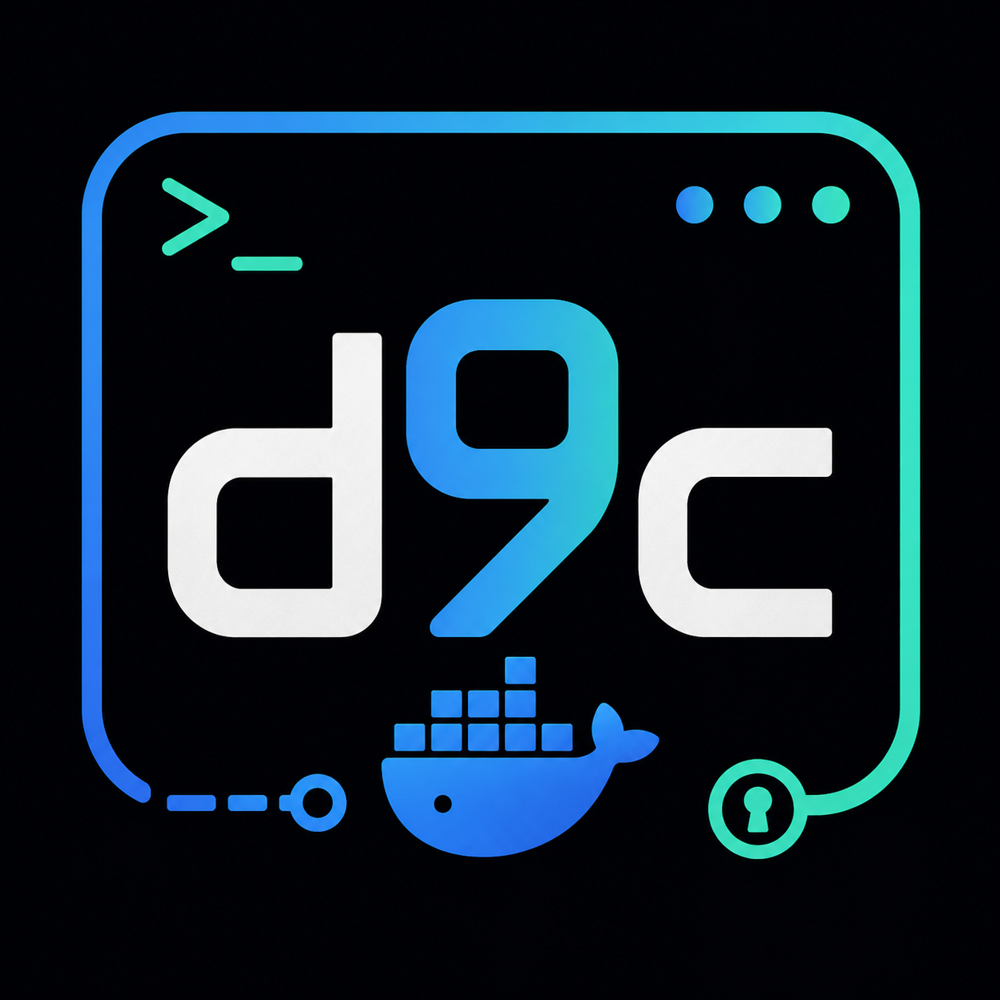
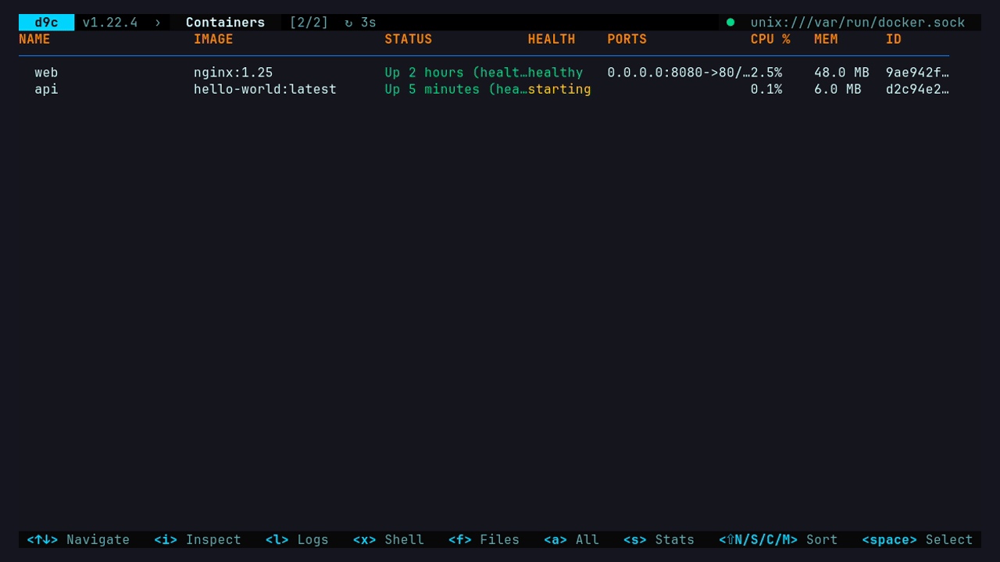

<p align="center">
  
</p>

# d9c

<p align="center"><b>English</b> · <a href="README-RU.md">Русский</a></p>

**A terminal (TUI) Docker manager for remote hosts** — in the spirit of [`k9s`](https://k9scli.io/)
and [`lazydocker`](https://github.com/jesseduffield/lazydocker), but focused on managing
Docker **over TCP or SSH**. A single binary, no agents on the remote side: connect to the daemon,
see containers, images, networks, volumes and Compose projects and manage them without leaving the terminal.

Built on [Bubble Tea](https://github.com/charmbracelet/bubbletea) and the official
[Docker SDK](https://pkg.go.dev/github.com/docker/docker).


[](https://github.com/kirg0/d9c/releases/latest)
[](https://github.com/kirg0/d9c/actions/workflows/ci.yml)
[](https://kirg0.github.io/d9c/coverage/)
[](https://pkg.go.dev/github.com/kirg0/d9c)


[](https://dalink.to/kirg08)

<p align="center">
  
</p>

> Want to take a look without setting up Docker? Run the demo on fake data:
> `go run . -demo`.

---

## Table of contents

- [Features](#features)
- [Installation](#installation)
- [Quick start](#quick-start)
- [Connecting to Docker](#connecting-to-docker)
- [Sections and navigation](#sections-and-navigation)
- [Filter `/`](#filter-)
- [Config, themes and keys](#config-themes-and-keys)
- [Container filesystem](#container-filesystem-f--files)
- [Port-forward](#port-forward-f--portforward)
- [Auto-refresh](#auto-refresh)
- [Stats view and graphs](#stats-view-and-graphs-s)
- [Resource threshold alerts](#resource-threshold-alerts)
- [Read-only mode](#read-only-mode)
- [Table columns](#table-columns)
- [Plugins](#plugins)
- [Development](#development)
- [Support the project](#support-the-project)
- [License](#license)

---

## Features

- **Remote Docker over TCP and SSH** — a single connection path for both transports, live
  `:connect`, saved hosts with CRUD, auto-reconnect on disconnect (backoff + banner).
- **All core resources** — Containers / Images / Networks / Volumes / Compose / Hosts.
- **Management, not just viewing** — start/stop/restart/kill/rm, bulk operations
  (multi-select with `Space` — bulk operations on containers and image removal),
  a `run` wizard, network/volume creation, `build`/`tag`/`push`
  (including to a private registry), `docker system df` and `prune` with confirmation.
- **Compose** — discovery by labels, `up`/`pull`/`down` with streaming, `config`, `edit`,
  `create`, backup/restore, project logs, drill-down into containers (operations on project
  files and running `docker compose` — over SSH only; see [Connecting to Docker](#connecting-to-docker)).
- **Logs and metrics** — `--tail/--since/--until`, search, save to file; live CPU/MEM/Net/Disk
  via the Stats API, with CPU/MEM history graphs for the selected container in the stats view (`s`).
- **Built-in terminal** — interactive `exec` into a container (vt10x emulator), a single path for
  TCP and SSH.
- **Container filesystem browser** — navigation and `docker cp` in both directions.
- **Port-forward over SSH** — a container (or compose service) port on `localhost:<port>`
  through the already open SSH connection; tunnels survive view switches and auto-reconnect.
- **Live daemon event log** (`docker events`) in a dedicated console.
- **Multi-host dashboard** — status and aggregates (`docker info`) across all saved hosts.
- **CPU/MEM alerts**, configurable **themes** and **hotkeys**, **plugins** (your own commands
  and keys from YAML — like in k9s).
- **Read-only mode** — `-read-only`, `readOnly:` in the config or `read_only` per host: view
  everything, change nothing (`RO` badge in the header).
- **Configurable columns** — `columns:` in the config: which columns each table shows and in
  what order.

---

## Installation

Nothing needs to be installed on the remote host — d9c talks to the Docker daemon directly.

| Method | Platforms | Command |
|--------|-----------|---------|
| [Homebrew](#homebrew) | macOS, Linux | `brew install kirg0/tap/d9c` |
| [Scoop](#scoop) | Windows | `scoop bucket add kirg0 https://github.com/kirg0/scoop-bucket` then `scoop install d9c` |
| [Install script](#install-script) | Linux, macOS | `curl -fsSL https://raw.githubusercontent.com/kirg0/d9c/main/install.sh \| sh` |
| [Docker image](#docker-image) | any with Docker | `docker run --rm -it ghcr.io/kirg0/d9c -H ssh://user@host` |
| [`go install`](#go-install) | any with Go 1.25+ | `go install github.com/kirg0/d9c@latest` |
| [Archive](#prebuilt-binaries) | Linux, macOS, Windows | download from [Releases](https://github.com/kirg0/d9c/releases/latest) |

The tap, the bucket and the image are updated automatically on every release.

### Homebrew

```sh
brew install kirg0/tap/d9c     # = brew tap kirg0/tap && brew install d9c
brew upgrade d9c
```

The formula installs the prebuilt binary for your architecture (Intel / Apple Silicon, Linux
x86-64 / ARM64), so no Go toolchain is pulled in.

### Scoop

```powershell
scoop bucket add kirg0 https://github.com/kirg0/scoop-bucket
scoop install d9c
scoop update d9c
```

### Install script

```sh
curl -fsSL https://raw.githubusercontent.com/kirg0/d9c/main/install.sh | sh
```

The script detects the OS (Linux / macOS) and the architecture (amd64 / arm64), downloads the
matching archive from GitHub Releases, **verifies its SHA-256 against the release
`checksums.txt`** (aborting on a mismatch) and installs `d9c` into `/usr/local/bin` (via `sudo`
when that directory is not writable), or `~/.local/bin` when there is no `sudo`. Settings are
environment variables:

| Variable | Meaning |
|----------|---------|
| `D9C_VERSION` | release to install, e.g. `v1.29.0` (default — the latest) |
| `D9C_INSTALL_DIR` | target directory instead of `/usr/local/bin` |
| `D9C_DOWNLOADER` | `curl` or `wget` (default — curl if installed; BusyBox wget works too) |

```sh
curl -fsSL https://raw.githubusercontent.com/kirg0/d9c/main/install.sh | D9C_VERSION=v1.29.0 D9C_INSTALL_DIR=~/bin sh
```

### Docker image

A multi-arch image (`linux/amd64`, `linux/arm64`) is published to
[ghcr.io/kirg0/d9c](https://github.com/kirg0/d9c/pkgs/container/d9c) with the tags `latest`,
`X.Y.Z` and `X.Y`. Run it interactively (`-it`), arguments go straight to `d9c`:

```sh
# local daemon through the mounted socket
docker run --rm -it -v /var/run/docker.sock:/var/run/docker.sock \
  ghcr.io/kirg0/d9c -H unix:///var/run/docker.sock

# remote host over SSH with your keys (known_hosts is updated on the first connect)
docker run --rm -it -v ~/.ssh:/root/.ssh ghcr.io/kirg0/d9c -H ssh://user@host

# ...or with the ssh-agent instead of key files
docker run --rm -it -v "$SSH_AUTH_SOCK:/ssh-agent" -e SSH_AUTH_SOCK=/ssh-agent \
  ghcr.io/kirg0/d9c -H ssh://user@host
```

The config (`d9c-config.yaml`) and plugins (`d9c-plugins.yaml`) live in the `/config`
volume — mount a directory there to keep saved hosts, theme and keys between runs:
`-v ~/.config/d9c:/config`. `make image` builds the image locally
(`packaging/Dockerfile`).

### Prebuilt binaries

No Go and no compiler required. Download the archive for your OS from the
[**Releases**](https://github.com/kirg0/d9c/releases/latest) page:

| OS | File |
|----|------|
| Linux (x86-64) | `d9c_vX.Y.Z_linux_amd64.tar.gz` |
| Linux (ARM64) | `d9c_vX.Y.Z_linux_arm64.tar.gz` |
| macOS (Intel) | `d9c_vX.Y.Z_darwin_amd64.tar.gz` |
| macOS (Apple Silicon) | `d9c_vX.Y.Z_darwin_arm64.tar.gz` |
| Windows (x86-64) | `d9c_vX.Y.Z_windows_amd64.zip` |
| Windows (ARM64) | `d9c_vX.Y.Z_windows_arm64.zip` |

Inside the archive there is a single executable (`d9c` or `d9c.exe`) plus `README.md` and `LICENSE`.

**Linux / macOS:**

```sh
# unpack and put it on PATH (example for Linux amd64)
tar -xzf d9c_vX.Y.Z_linux_amd64.tar.gz
sudo install d9c_vX.Y.Z_linux_amd64/d9c /usr/local/bin/d9c

d9c -version          # check
```

> macOS may block an unsigned binary on first launch
> ("cannot be opened because the developer cannot be verified"). Remove the quarantine:
> `xattr -d com.apple.quarantine ./d9c`.

**Windows (PowerShell):**

```powershell
# unpack the zip and run d9c.exe from that folder,
# or put it in a directory that is on %PATH%
Expand-Archive d9c_vX.Y.Z_windows_amd64.zip
.\d9c_vX.Y.Z_windows_amd64\d9c.exe -version
```

**Checksum verification (optional).** Each release ships a
`checksums.txt` (SHA-256):

```sh
sha256sum -c checksums.txt 2>/dev/null | grep d9c_vX.Y.Z_linux_amd64.tar.gz
```

```powershell
# Windows
(Get-FileHash .\d9c_vX.Y.Z_windows_amd64.zip -Algorithm SHA256).Hash
```

### `go install`

With [Go 1.25+](https://go.dev/dl/) installed:

```sh
go install github.com/kirg0/d9c@latest   # binary lands in $(go env GOPATH)/bin
```

### Building from source

Requires [Go 1.25+](https://go.dev/dl/):

```sh
git clone https://github.com/kirg0/d9c.git
cd d9c
make build          # binary ./d9c (or d9c.exe on Windows)
```

or directly via `go`:

```sh
go build -o d9c .
```

The version can be baked into the binary at build time (release builds do this automatically):

```sh
go build -ldflags "-X github.com/kirg0/d9c/internal/version.Version=1.2.3" -o d9c .
```

The application follows [SemVer](https://semver.org); the current version is shown in the header (`d9c vX.Y.Z`)
and printed by the `-version` flag.

---

## Quick start

```sh
go run . -demo                 # demo data, no Docker
go run . -H tcp://host:2375    # remote daemon over TCP
go run . -H ssh://user@host    # remote daemon over an SSH tunnel
go run . -context prod         # endpoint of a Docker CLI context
go run . -version              # print the version and exit
```

> The examples above are for running from source. If you installed a prebuilt binary,
> use `d9c` instead of `go run .` (e.g. `d9c -demo`, `d9c -H ssh://user@host`).

If no host is specified, d9c opens on the **Hosts** section, where you can pick a saved host
or add a new one — the connection happens via `Enter` / `:connect`.

---

## Connecting to Docker

| Transport | Example | Note |
| --- | --- | --- |
| TCP | `-H tcp://host:2375` | the daemon must listen on TCP (`-H tcp://0.0.0.0:2375` on the server side) |
| SSH | `-H ssh://user@host` | an SSH tunnel to the local daemon socket; keys from the agent/`~/.ssh` |
| nerdctl (local) | `-H nerdctl://` | containerd via a local `nerdctl` (see [containerd](#containerd)) |
| nerdctl (SSH) | `-H nerdctl+ssh://user@host` | containerd via `nerdctl` on a remote host over SSH |
| CRI (local) | `-H crio://` | CRI-O / any CRI runtime via a local `crictl` (see [CRI-O](#cri-o--generic-cri)) |
| CRI (SSH) | `-H crio+ssh://user@host` | a CRI runtime via `crictl` on a remote host over SSH |

> **TCP vs SSH — what's available.** Almost everything (containers, images, networks, volumes, exec,
> container FS browser, events, dashboard) works over both transports via the Docker Engine API.
> But Compose operations that need access to the **host filesystem** or run `docker compose`
> itself as a process go around the API — SSH only. So **when connected over TCP the following
> Compose commands are unavailable** (they don't appear in the hints or in `?`):
> `create`, `up`, `down`, `pull`, `config`, `edit`, `backup`, `restore` (and the `e` key —
> edit the file). Over TCP you still get project discovery, view/inspect/logs, the local `backups`
> directory (view and delete archives only — restore requires SSH) and project container
> management: `start` / `stop` / `restart` / `pause` / `unpause` / `remove`. Need the
> full Compose set — connect via `-H ssh://...`.

### Docker contexts

d9c reads the Docker CLI context store (`~/.docker/contexts`, or `$DOCKER_CONFIG/contexts`):

- **`-context <name>`** starts straight on that context's endpoint (`tcp://`, `ssh://`,
  `unix://`, `npipe://`) and remembers it in Hosts under the context name. Precedence follows the
  Docker CLI: `-context` wins over `DOCKER_HOST`/`DOCKER_CONTEXT`, but combining it with `-H` is an
  error; without `-context`, an explicit `-H` or `DOCKER_HOST` disables contexts, otherwise
  `DOCKER_CONTEXT` names one. `default` means "no context". The `currentContext` from
  `~/.docker/config.json` is **not** applied automatically — a bare launch still opens Hosts.
- **`:import contexts`** in the Hosts section opens a picker (`space` — check, `a` — all,
  `Enter` — import the checked ones or the highlighted one); `:import contexts <name>...` imports
  by name without the picker. The current context and ones whose URL is already saved are marked;
  already-saved URLs are skipped, and a name clash gets a suffix (`prod-2`).
- **TLS contexts are supported:** `ca.pem` / `cert.pem` / `key.pem` from the context are stored
  per host (`tls_ca_cert` / `tls_cert` / `tls_key`) and used for that host only — including
  the dashboard probe and auto-reconnect; a CA alone (without a client certificate) is enough.
  `SkipTLSVerify` is **not** supported: such contexts are imported, but the server certificate
  is still verified (the footer says so).

### containerd

containerd has **no** Docker-compatible REST API, so d9c cannot talk to it the way it talks to
Docker or Podman. Instead of a native gRPC client (heavy, and lacking logs/networks/volumes/
compose) d9c drives containerd through [`nerdctl`](https://github.com/containerd/nerdctl) —
the Docker-compatible CLI frontend. `nerdctl` must be installed on the machine where containerd
lives ([installation guide](https://github.com/containerd/nerdctl#install) — binaries from
releases + CNI plugins; rootless mode — [docs/rootless.md](https://github.com/containerd/nerdctl/blob/main/docs/rootless.md)):

```
# containerd on this machine
d9c -H nerdctl://

# containerd on a remote host (nerdctl is executed there over SSH)
d9c -H nerdctl+ssh://user@host
```

When connected through nerdctl, the header shows a **containerd** chip together with the active
**namespace** (`containerd:default`). All sections work: Containers (list/start/stop/restart/
kill/rm/inspect/logs/stats/run), exec (over the SSH transport), Images (pull/rmi/tag/push/build/
history), Networks, Volumes, Compose (discovery by the same labels + reconstructed
`up`/`down`/`pull`), events, `system df`/`prune`.

**Namespaces.** containerd shards its objects by namespace (`default`, `k8s.io` for Kubernetes,
etc.). The `:namespace <name>` command switches the namespace; `:namespace` with no argument
opens a picker. Every command is automatically scoped to the active namespace. An unknown name
is accepted without an error — containerd creates the namespace lazily on the first write.

#### nerdctl backend fine print

- **Local and SSH limitations mirror each other.** Copying files into/out of a container
  (`cp`) works only with a local nerdctl (`nerdctl://`): over SSH the files would land on the
  remote host, not on the machine running d9c. Interactive `exec` / `run -it` is the opposite —
  SSH only (`nerdctl+ssh://`): bridging a local PTY into the built-in terminal is not
  implemented. Everything else works on both transports.
- **Compose without a compose file.** nerdctl does not stamp the `working_dir`/`config_files`
  labels and has no `compose ls`, so the path of a discovered project's compose file cannot be
  recovered. The `up`/`pull`/`down` commands are reconstructed from the
  `com.docker.compose.project` labels (present on both containers and networks): `up` = start
  the project's containers (**not** a recreate from the file), `pull` = pull every service's
  image, `down` = remove the project's containers and networks (named volumes are kept — same
  as `docker compose down` by default). `config` / `edit` (the `e` key) / `backup` / `restore`
  are unavailable — they need the compose file itself.
- **`system df` is emulated.** nerdctl 2.x has no `system df` subcommand; the report is
  assembled from the object lists: images with their summed size, containers (total/running),
  volumes. Volume sizes are not computed: `volume ls --size` walks every volume and can be very
  slow on real hosts.
- **Stats are one-shot.** CPU%/MEM in Containers come from `nerdctl stats --no-stream`;
  nerdctl reports a ready-made CPU%, so no cross-tick delta bookkeeping (as with the Docker
  API) is needed.
- **The `network:` filter.** The JSON output of `nerdctl ps` has no Networks field — the
  container's networks are extracted from nerdctl's own `nerdctl/networks=["…"]` label.
- **Events are rare.** An idle containerd host emits almost no events (none of the
  healthchecks and background chatter of a typical docker daemon) — until the first event the
  viewer shows a "waiting for events…" hint, and if the stream ends (the `nerdctl events`
  process died, SSH dropped) the feed gets an `[error] event stream ended — press r` line.
- **PATH and iptables over SSH.** A non-interactive SSH session has no `/usr/sbin` in PATH,
  while nerdctl invokes `iptables` when publishing ports (`run -p …`) — without it the run
  fails with `failed to load networking flags`. d9c prepends `/usr/local/sbin:/usr/sbin:/sbin`
  to PATH for every nerdctl command over SSH.
- **`nerdctl+ssh://` is a first-class SSH host.** The Hosts section offers it the same
  authentication options as `ssh://`: a key (custom path or ssh-agent/`~/.ssh`) or a password
  with the login/password modal on connect.
- **The Hosts dashboard** is filled from `nerdctl info --format json` (host name, CPUs,
  memory) and `nerdctl version` (the containerd version from `Server.Components`); the
  container/image counters are computed from the lists.
- **Friendly errors.** nerdctl's logrus wrapper (`time="…" level=fatal msg="…"`) is stripped
  from every error — the UI shows just the substance ("no such image: …").
- **The container FS browser** works by running `ls -1Ap` inside the container (containerd
  exposes no readdir API) — the image must contain `ls`.
- **Rootless is supported** — the backend was live-tested on Debian 13 with containerd v2.3.2
  and rootless nerdctl 2.3.4.

### CRI-O / generic CRI

For runtimes speaking **CRI** (the Kubernetes Container Runtime Interface) — CRI-O,
containerd's CRI plugin, cri-dockerd — d9c works through
[`crictl`](https://github.com/kubernetes-sigs/cri-tools), the official CRI client. `crictl`
must be installed on the machine where the runtime lives:

```
# CRI runtime on this machine (crictl finds the socket itself or reads /etc/crictl.yaml)
d9c -H crio://

# explicit socket path
d9c -H crio:///var/run/crio/crio.sock
d9c -H cri:///run/containerd/containerd.sock

# runtime on a remote host (crictl is executed there over SSH)
d9c -H crio+ssh://user@host
d9c -H cri+ssh://user@host/run/crio/crio.sock
```

`crio://` and `cri://` are synonyms (one shared backend); `crio+ssh://` is a first-class SSH
host with the same key/password authentication as `ssh://`. The header shows a **cri-o** chip
(or **cri** for another runtime — from the `RuntimeName` of `crictl version`).

**What works.** Containers — listings (names render as `pod/container`: the pod is CRI's
grouping unit), inspect, start/stop/rm, kill (maps to CRI `stop` with a zero timeout — CRI has
no other signals), logs (`-f/--tail/--since`), CPU/MEM metrics (CPU% is derived as the delta of
the cumulative counter between refresh ticks), interactive exec (over the SSH transport, like
nerdctl), the container FS browser (`ls` inside the container); Images — list/inspect/`rmi`/
`pull`/`prune`; events (requires cri-tools ≥ 1.26); `system df` is emulated from the lists;
the Hosts dashboard gets the counters and the runtime version.

**What CRI has no notion of** — soft degradation: Networks/Volumes/Compose show empty lists
(networking belongs to CNI, volumes and compose to the orchestrator), while build/tag/push/
`run`/`cp` answer with a clear "CRI manages only pods, containers and images" error. Creating
containers is the kubelet/orchestrator's job, not a TUI's. Also note that some runtimes refuse
to start an exited container (`restart` may return the runtime's error) — in Kubernetes the
kubelet recreates containers instead.

#### Setting up a CRI-O host

Verified with a live run against Debian 13 + CRI-O 1.33. For d9c to work fully:

- **`crictl`** — the `cri-tools` package is missing from some repositories (e.g. openSUSE OBS
  `isv:/cri-o`) — grab the binary from
  [cri-tools releases](https://github.com/kubernetes-sigs/cri-tools/releases) instead. Set the
  endpoint in `/etc/crictl.yaml`, otherwise crictl probes sockets with warnings:

  ```yaml
  runtime-endpoint: unix:///var/run/crio/crio.sock
  image-endpoint: unix:///var/run/crio/crio.sock
  ```

- **Socket access.** `/var/run/crio/crio.sock` is owned by root — connect as
  `crio+ssh://root@host` (or grant your user access to the socket).
- **Events (`:events`).** CRI-O only serves the event stream with `enable_pod_events = true`
  (a drop-in under `/etc/crio/crio.conf.d/`); without it the stream closes right after opening
  and the viewer reports a finished stream.
- **Idempotent stop.** `crictl stop` of a nonexistent container succeeds (a CRI-O trait) —
  stopping a stale list row won't surface an error.
- **Standalone rigs without Kubernetes.** CRI-O's packaged CNI config ships disabled
  (`/etc/cni/net.d/10-crio-bridge.conflist.disabled` — rename it, dropping `.disabled`), and
  old CNI plugins (e.g. 1.1.1 from Debian) fail the bridge CHECK
  ("Interface veth… Mac doesn't match") — install plugins ≥ 1.5 from
  [containernetworking/plugins](https://github.com/containernetworking/plugins/releases) into
  `/opt/cni/bin`. This matters for creating pods (`crictl runp`); d9c itself never creates
  pods, but without CNI a test rig has nothing to fill the lists with.

The **Hosts** section is both the list of saved hosts and a multi-host dashboard: each host gets a row
with status (● up/down) and an aggregate from `docker info` (containers/running/images/daemon version).
Data is collected over a single connection per host, refreshed roughly every 10 seconds. `Enter` — connect
to the selected host. Management right from the section: `a` — add, `e` — edit, `d` — delete
(with confirmation); the same actions are available via the `:add` / `:edit` / `:rm` commands, and
`:import contexts` adds hosts from Docker contexts (see [Docker contexts](#docker-contexts)). The
`:dashboard` / `:dash` commands are aliases for `:hosts`. The host list is stored in the shared
`d9c-config.yaml` (the `hosts:` section, see [Config, themes and keys](#config-themes-and-keys)).

For `ssh://` hosts the add/edit form lets you choose the authentication method
(`←/→/space` toggle):

- **Key** — the "Key path" field takes a custom private-key path; empty falls back
  to ssh-agent and the default `~/.ssh` keys.
- **Password** — only the login is saved to the config; the password is never
  written to disk. On connect (`Enter` / `:connect`) a modal prompts for the login
  and password: the saved login is pre-filled but editable before connecting. The
  password lives in memory only for the session.

---

## Sections and navigation

Sections: **Containers / Images / Networks / Volumes / Compose / Hosts**.

- Navigation — arrow keys / `j` / `k`, `PgUp/PgDn`, `g`/`G`.
- Filter — `/`, command line — `:`, quit — `q`.
- Key hints are in the bottom line; full help for the current section is on the `?` key.

---

## Filter `/`

Plain text is a case-insensitive substring (multiple words are logical AND).
Structured terms are also available (for Containers they are the richest):

| Term | What it does |
| --- | --- |
| `nginx` | substring in name/image/status |
| `re:^web-\d+` | regular expression (case-insensitive) |
| `status:running` | by status/state (`running`, `exited`, `healthy`…) |
| `label:env` / `label:env=prod` | by container label (key or key=value) |
| `network:frontend` (`net:`) | by attached network |

Terms combine with a space (AND): `status:running label:env=prod net:bridge`.
A regex error is highlighted right in the filter line.

---

## Config, themes and keys

**All application settings** — theme, color overrides, hotkeys, alert thresholds
and the **list of saved hosts** — live in a single YAML file. By default d9c looks for
**`d9c-config.yaml` next to the executable**; a different path can be set with a flag:

```sh
d9c -config /path/to/d9c-config.yaml
```

Plugins are the only exception: they live in a separate `d9c-plugins.yaml`. A missing config
is not an error — the built-in `tokyonight` theme and an empty host list are used. The file is read
at startup, and changes made from the interface (editing hosts, picking a theme in the picker)
are written back immediately — the other sections are preserved. An old standalone
`d9c-hosts.json` is **automatically migrated** into the new config's `hosts:` on first run
(the file is renamed to `d9c-hosts.json.migrated`).

```yaml
lang: en                  # UI language: en (default) or ru
theme: dracula            # built-in palette (tokyonight by default)
colors:                   # optional pointwise color overrides
  primary: "#ff79c6"
  danger: "#ff5555"
hosts:                    # saved hosts (Hosts section; usually edited from the UI)
  - name: prod
    host: ssh://user@prod.example.com
    ssh_auth: key          # key | password (empty = key via ssh-agent/~/.ssh)
    ssh_key_path: ~/.ssh/prod_ed25519   # optional; for ssh_auth: key
  - name: staging
    host: ssh://deploy@staging.example.com
    ssh_auth: password     # prompts for the password on connect; never stored
  - name: local
    host: tcp://localhost:2375
  - name: secure           # e.g. imported from a TLS Docker context
    host: tcp://secure.example.com:2376
    tls_ca_cert: ~/.docker/contexts/tls/<id>/docker/ca.pem   # optional, tcp:// only
    tls_cert: ~/.docker/contexts/tls/<id>/docker/cert.pem
    tls_key: ~/.docker/contexts/tls/<id>/docker/key.pem
```

Built-in themes: `tokyonight`, `dracula`, `nord`, `gruvbox`, `solarized`,
`catppuccin`, `k9s` (bright, in the spirit of the k9s skin). The theme can also be switched
**on the fly, without a config** — via the `:theme <name>` command (e.g. `:theme nord`); `:theme`
without an argument opens a picker modal with a list of themes and live preview (arrows —
preview, Enter — apply, q/Esc — cancel). Picking a theme through the picker (Enter)
is **saved to the config** (`theme:`) — it survives a restart; `:theme <name>` changes the theme
for the current session only. In `colors` you can override any of the base colors on top of the
selected theme:

**The UI language** is switched the same way: the `:lang` command with no argument opens a
picker modal (`Русский` / `English`, arrows — preview, Enter — apply, q/Esc — cancel), while
`:lang en` / `:lang ru` change the language directly. The choice is **saved to the config**
(`lang:`) and survives a restart. The interface is English by default.

| Key | Purpose |
| --- | --- |
| `primary` | accents, active keys, indicators |
| `secondary` | table headers, labels |
| `success` | running / healthy / "● up" |
| `warning` | transitional states (paused, reconnect) |
| `danger` | errors, stopped, unhealthy |
| `muted` | dimmed text, separators |
| `bg` / `bgalt` | background and raised surfaces (selection, bars, modals) |
| `fg` | primary text |
| `border` | frames and lines |

A color value is hex (`#rgb` or `#rrggbb`) or an ANSI palette index `0`–`255`.
An unknown theme, an unknown color key or an invalid value is an error at
startup (`loading config: …`).

### Keys

Normal-mode actions can be remapped in the `keys:` section of the same
`d9c-config.yaml`. Only the actions you want to change need to be listed —
the rest stay at their defaults:

```yaml
keys:
  filter: f        # filter instead of "/"
  logs: g          # logs instead of "l"
  select: space    # mark for a bulk operation (the alias "space" = the spacebar)
```

| Action | Default | What it does |
| --- | --- | --- |
| `inspect` | `i` | details of the selected resource |
| `logs` | `l` | container / compose-project logs |
| `edit` | `e` | edit the compose file |
| `exec` | `x` | shell in a container (built-in terminal) |
| `filter` | `/` | filter by rows |
| `command` | `:` | command line |
| `toggle-all` | `a` | all / running only |
| `stats` | `s` | CPU/MEM metrics + history graphs |
| `select` | `space` | mark for a bulk operation |
| `copy` | `y` | copy menu |
| `refresh` | `r` | refresh manually |
| `pause` | `p` | pause/resume auto-refresh |
| `help` | `?` | help |
| `port-forward` | `F` | forward a container port to localhost |

A value is a key name in Bubble Tea notation (`f`, `ctrl+d`, `f5`, `space`, etc.).
Navigation (`↑/↓`, `j/k`, `PgUp/PgDn`), `Enter` and the quit keys (`q`, `esc`,
`Ctrl+C`) are fixed and cannot be remapped. An unknown action, an empty key, a
reserved key or one key bound to two actions is an error at startup
(`loading keybindings: …`). The `?` help shows the actual (remapped) keys.

---

## Container filesystem (`f` / `:files`)

In the **Containers** section the `f` key (or the `:files [path]` command) opens a browser of
the selected running container's filesystem. The listing is built via `ls`
inside the container, so in minimal images without `ls` (scratch/distroless) the
browser is unavailable (this is reported with a clear error).

| Key | Action |
| --- | --- |
| `enter` / `l` | enter a directory |
| `⌫` / `h` / `-` | go up one level |
| `d` | download the selected file/directory into d9c's working directory (`docker cp` out of the container) |
| `↑/↓` `j/k`, `g`/`G`, `PgUp/PgDn` | navigate the list |
| `q` / `esc` | close the browser |

Uploading INTO a container is done with the `:cp <local-path> <container-dir>` command (the target path
must be an existing directory inside the container). Calling `:cp` **without
arguments** opens a modal wizard: a built-in picker for the local filesystem
(navigating the machine where d9c runs) plus a destination directory field in the
container — `Tab` switches focus, `enter`/`l` enters a directory, `⌫`/`h`
goes up, `enter` in the destination field starts the upload. Downloading unpacks
the daemon's tar stream to disk with protection against escaping the destination
directory; symlinks and special files are skipped.

---

## Port-forward (`F` / `:portforward`)

`F` in **Containers** (or in **Compose** — then the form lets you pick one of the project's
running containers with `←/→`) opens a form: the container port (pre-filled from the
container's ports) and the local port (empty = any free one). d9c listens on
`127.0.0.1:<local>` and forwards every connection to the container:

- **`ssh://` hosts** — through the already open SSH connection (`direct-tcpip`, like
  `ssh -L`): a published port is dialed on the host's loopback, an unpublished one on the
  container IP (`127.0.0.1` for `network_mode: host`). Nothing extra has to be open on the
  server besides SSH.
- **`tcp://` hosts** — straight to the port the container **publishes** on the daemon
  host; an unpublished port is rejected with a hint to use `ssh://`.
- CRI-O / containerd (nerdctl) backends don't support port-forward yet.

The target is re-resolved on every connection, so a restarted container (new IP) is still
reached. An active tunnel is marked in the PORTS column (`⇄:8080`) and counted in the header
(`⇄ 1`). A busy local port is reported in the form with a hint.

`:portforward` (`:pf`) lists all tunnels from any section:

| Key | Action |
| --- | --- |
| `s` / `space` | stop / start (a restart re-binds the same local port) |
| `d` | delete the tunnel |
| `y` | copy the local address |
| `q` / `esc` | close the list |

Tunnels live independently of the current section and survive auto-reconnect (while the
connection is down a tunnel is shown as `failing` with the error, then recovers). Switching
to another host (`:connect`) or quitting d9c closes all tunnels.

---

## Auto-refresh

Lists are refreshed on a timer. The initial interval is set by the `-interval` flag
(e.g. `-interval 5s`, `3s` by default); the `:interval <dur>` command changes it on the fly
(`:interval 10s`, range `1s`–`1h`), and `:interval` without an
argument shows the current value. The `p` key (or `:interval pause` /
`:interval resume`) pauses and resumes auto-refresh — the server status
indicator keeps working meanwhile, and manual refresh via `r` is always available.
The state is shown in the header: `↻3s` — the active interval, `⏸ paused` — paused.

---

## Stats view and graphs (`s`)

In Containers, `s` switches the table to the `docker stats` layout (CPU % / MEM / MEM % /
NET I/O / BLOCK I/O) and opens a graph panel under it for the container under the cursor:
the CPU and MEM history over the last 120 samples (one per auto-refresh — 6 minutes at the
default 3s). The graphs are drawn from the moment d9c starts polling, so history accumulates
while the app runs; the panel shows the current value, the peak (`max`) and, for memory,
the minimum of the window.

- The charts are drawn with Braille dots (2×4 per character cell) and neighbouring samples
  are joined by interpolation, so the outline rises and falls smoothly instead of in steps.
- CPU starts at 0%; memory is scaled over its min…max range, so growth and leaks
  stand out even when usage barely moves.
- The chart width follows the window width; on tall windows (≥ 32 lines) each chart is
  3 rows high, on medium ones (≥ 18 lines) 2 rows, and on very small windows the panel
  is hidden and the table keeps the whole screen.
- Colors come from the active theme.

## Resource threshold alerts

Containers whose load exceeds a given threshold are highlighted with a `⚠` marker
next to the name (in both Containers table modes), and a `⚠ N` counter appears in the
header — the number of "hot" containers. The thresholds rely on the live Stats API metrics
(the same CPU%/MEM% as in `s` mode); stopped and not-yet-polled containers
are not counted.

The initial thresholds are set by the `alerts:` section in `d9c-config.yaml` (optional;
`0` or absence = the metric is off):

```yaml
alerts:
  cpu: 80     # highlight a container at CPU% ≥ 80 (may exceed 100 on multi-core)
  mem: 90     # highlight at MEM% ≥ 90
```

The thresholds are changed on the fly with the `:alert` command:

| Command | Action |
| --- | --- |
| `:alert cpu <%>` | CPU% threshold (e.g. `:alert cpu 80`) |
| `:alert mem <%>` | MEM% threshold |
| `:alert cpu off` / `:alert mem off` | turn off an individual metric |
| `:alert off` | turn alerts off entirely |
| `:alert` | show the current thresholds |

## Read-only mode

Read-only mode protects a host from accidental changes: d9c still shows everything (lists,
details, logs, stats, events, file browser, port-forward), but every action that changes state
on the Docker host is refused — start/stop/restart/kill/rm, `prune` (including `:system prune`),
`run`, `exec` (`x`), `cp`, compose `up`/`down`/`pull`/`edit`/`restore`/lifecycle, image
`build`/`tag`/`push`/`pull`, network/volume creation and plugins marked `mutating: true`.
An attempt shows `read-only mode: <action> is disabled` in the footer, the header carries an
`RO` badge, and the hints/help/autocomplete entries of mutating actions are hidden.

It is enabled in one of three ways:

```sh
d9c -read-only -H ssh://user@prod.example.com   # for the whole session
```

```yaml
readOnly: true            # d9c-config.yaml: every host, every session
hosts:
  - name: prod
    host: ssh://user@prod.example.com
    read_only: true       # only while connected to this host
```

The per-host flag follows the connection: `:connect` to a `read_only` host turns the mode on,
connecting to another host turns it off again. The global mode (flag or `readOnly:`) cannot be
switched off at runtime. `read_only` is set in the config file only — editing the host from the
UI keeps it. Local operations are not affected: managing saved hosts, themes, language, alert
thresholds, compose backups (`:backup`, deleting local backup files) and downloading files from
containers.

## Table columns

The `columns:` section of `d9c-config.yaml` sets which columns each table shows and in what
order. Every key is optional — a section without an entry keeps the built-in layout:

```yaml
columns:
  containers: [name, status, health, cpu, mem, id]   # default layout of Containers
  stats: [name, cpu, mem, "mem %", id]               # the `s` (docker stats) layout
  images: [repository, size, id]
  networks: [name, driver, subnet, id]
  volumes: [name, driver, created]
  compose: [project, status, path]
  hosts: [name, status, running, version]
```

| Section | Columns |
| --- | --- |
| `containers` | NAME, IMAGE, STATUS, HEALTH, PORTS, CPU %, MEM, **ID** |
| `stats` | NAME, CPU %, MEM, MEM %, NET I/O, BLOCK I/O, **ID** |
| `images` | REPOSITORY:TAG, SIZE, CREATED, **ID** |
| `networks` | NAME, DRIVER, SCOPE, SUBNET, **ID** |
| `volumes` | **NAME**, DRIVER, MOUNTPOINT, CREATED |
| `compose` | PROJECT, NAME, **PATH**, STATUS, COMMAND |
| `hosts` | **NAME**, HOST, STATUS, CONTAINERS, RUNNING, IMAGES, VERSION |

Names are case- and punctuation-insensitive (`cpu %`, `CPU%` and `cpu` are the same column;
`net io`/`net`, `block`, `repository`/`repo`/`tag` also work). The visible columns share the full
table width in proportion to their default widths. The column in **bold** identifies the row
(actions, drill-down, copy) and is always shown — if it is left out, it is put back at its default
position. An unknown section or column and a duplicate are skipped; an empty list keeps the
default layout. Such problems are listed in a notice window at startup.

---

## Plugins

Plugins are **custom commands and hotkeys** described in a YAML file
(like in k9s). Each plugin runs a **local** command (on the machine where
d9c runs) with substitution of the selected row's data. This lets you wire in `dive`, `lazydocker`,
`ctop`, your own scripts, `docker` commands and so on — without changing the application code.

### Where the file lives

By default d9c looks for the file **`d9c-plugins.yaml` next to the executable**.
A different path can be set with a flag:

```sh
d9c -plugins-file /path/to/plugins.yaml
```

A missing file is not an error, there will just be no plugins. The file is read **once at
startup**: after editing it, restart d9c.

### File format

The root is the `plugins` key with a list of objects:

```yaml
plugins:
  - name: dive                 # required — the command name (invoked as :dive)
    key: ctrl+d                # optional — a hotkey
    scope: images              # in which section it's available (default "*")
    description: Image layers  # optional — for documentation
    command: dive              # required — the executable (without arguments)
    args: ["${ID}"]            # optional — arguments (each on its own line)
    background: false          # optional — launch mode (default false)
    mutating: false            # optional — changes the host (disabled in read-only mode)
```

#### Fields

| Field         | Req. | Description |
|---------------|:----:|----------|
| `name`        | yes  | The command name. Invoked as `:name`. |
| `command`     | yes  | The executable name/path. **Run directly, without a shell.** |
| `args`        | no   | The argument list. Each one is a separate list item (not a single string). |
| `scope`       | no   | The section where the plugin is active. Default `*` (everywhere). |
| `key`         | no   | A hotkey (Bubble Tea format: `ctrl+d`, `f5`, `alt+x`…). |
| `description` | no   | A short description (documentation). |
| `background`  | no   | `false` — interactive (takes over the terminal); `true` — in the background with output to a console. |
| `mutating`    | no   | `true` — the plugin changes the Docker host: it is refused and hidden in [read-only mode](#read-only-mode). |

#### Allowed `scope` values

`containers`, `images`, `networks`, `volumes`, `compose`, `hosts`, or `*` (any section).
Case-insensitive. A plugin with `scope: containers` is only available in the containers section;
`scope: "*"` — in all of them.

### `${VARIABLE}` substitution

Before launch, the values from the **selected row** are substituted into `command` and into each
`args` item. Unknown placeholders are left as is (so a typo is visible).

Always available:

| Variable | Value |
|------------|----------|
| `${HOST}`  | The address of the current Docker host (`tcp://…` or `ssh://…`). |
| `${ID}`    | The identifier of the selected row. For containers/images/networks — the ID; for volumes/projects/hosts — the name (which is also the row key). |

Depending on the section, the following are added:

| Section (`scope`) | Additionally |
|------------------|---------------|
| `containers`     | `${NAME}` `${IMAGE}` `${STATUS}` `${STATE}` `${PORTS}` |
| `images`         | `${NAME}` `${IMAGE}` `${TAGS}` (all three = the image tags) |
| `networks`       | `${NAME}` `${DRIVER}` |
| `volumes`        | `${NAME}` `${DRIVER}` |
| `compose`        | `${NAME}` `${PATH}` (the working directory) `${STATUS}` |
| `hosts`          | `${NAME}` `${HOST}` (the URL of the selected host) |

> The remote daemon is `${HOST}`. Since the command runs locally, for actions
> against the remote daemon call the local client with this address, e.g.
> `docker -H ${HOST} …` or `docker -H ${HOST} exec -it ${ID} sh`.

### How to invoke a plugin

- **By command:** `:` → type `name` → Enter. The plugin names for the current section appear
  in autocompletion.
- **By key:** if `key` is set — press it in the appropriate section. The binding is shown
  in the hints at the bottom of the screen.

**Built-in commands and keys always take priority.** If you name a plugin like a built-in
command (`stop`, `rm`, `logs`…) or bind it to a taken key (`i`, `l`, `x`, `s`,
`a`, `/`, `:`…), the built-in action fires. So for keys prefer
`ctrl+<letter>` or function keys (`f2`…`f12`), and pick names different from the
built-in ones.

### Launch modes

**Interactive (`background: false`, default).** d9c **hands over the terminal**
to the launched program (like `exec`/shell), and returns the interface after it exits.
Suitable for interactive programs: a shell in a container, `dive`, `lazydocker`, `vim`,
`htop`. A non-zero exit code is shown as an error in the bottom line.

**Background (`background: true`).** The command runs without taking over the terminal, and its
stdout/stderr are **streamed line by line into the operation console** (like `compose up` progress).
Suitable for one-off commands that print text (`docker system df`, reports, scripts).
Close the console with `q`/`esc`.

### Important limitations

- **No shell.** `command` runs directly, so pipelines (`|`), redirections
  (`>`), substitutions (`$(…)`), wildcards (`*`) and environment variables are **not** expanded.
  To use them, call a shell explicitly:
  - Linux/macOS: `command: sh`, `args: ["-c", "docker -H ${HOST} logs ${ID} | tail -n 100"]`
  - Windows: `command: cmd`, `args: ["/c", "…"]`
- **The command runs locally**, on the machine with d9c. The needed binaries (`docker`, `dive`,
  `lazydocker`…) must be installed and available on `PATH`.
- **Cross-platform.** The paths to the shell and utilities differ on Windows and Linux —
  keep in mind where d9c runs.
- The file is read at startup; after changes a restart is needed.

### Full `d9c-plugins.yaml` example

```yaml
plugins:
  # An interactive shell in the selected container (via the remote daemon).
  - name: sh
    key: ctrl+s
    scope: containers
    description: Shell inside the container
    command: docker
    args: ["-H", "${HOST}", "exec", "-it", "${ID}", "sh"]

  # Explore image layers with dive.
  - name: dive
    key: ctrl+d
    scope: images
    description: Image layer analysis
    command: dive
    args: ["${TAGS}"]

  # Full lazydocker, connected to the same host.
  - name: lazy
    scope: "*"
    command: lazydocker

  # The daemon's disk usage — output to the operation console.
  - name: df
    scope: "*"
    background: true
    description: docker system df
    command: docker
    args: ["-H", "${HOST}", "system", "df"]

  # The last 200 log lines through a shell pipeline (in the background).
  - name: tail
    scope: containers
    background: true
    command: sh
    args: ["-c", "docker -H ${HOST} logs --tail 200 ${ID}"]
```

### Troubleshooting

- **The plugin isn't invoked by `:name`** — check the `scope` (does it match the current
  section or `*`) and that the name doesn't collide with a built-in command.
- **The key doesn't fire** — it's probably taken by a built-in action; change it to
  `ctrl+<…>`/`fN`.
- **`executable file not found`** — the needed binary isn't on `PATH` on the machine with d9c.
- **A pipeline/`>`/`*` "doesn't work"** — that's expected: wrap the command in `sh -c "…"` /
  `cmd /c "…"`.
- **A `loading plugins: …` error at startup** — invalid YAML, or a plugin without `name`/
  `command`, or with an unknown `scope`. Fix the file and restart.

---

## Development

The full set of checks before a commit (quality gate):

```sh
make check      # = fmtcheck + vet + golangci-lint + test
```

or manually:

```sh
gofmt -l .               # should be empty
go vet ./...
golangci-lint run ./...  # config in .golangci.yml; install: make tools
go test ./...
go test -race ./...      # for concurrent code
```

Useful Makefile targets: `make build`, `make run ARGS="-H tcp://host:2375"`, `make demo`,
`make test`, `make race`, `make lint`, `make tools` (installs `golangci-lint`/`staticcheck`).

Architecturally all Docker operations are hidden behind the `docker.Backend` interface, so the demo mode
(`-demo`) and headless tests use `FakeBackend` and don't require a real daemon. The UI is built
on the Elm model (Bubble Tea): `Update` doesn't block the event loop, long operations go through `tea.Cmd`.

---

## Support the project

d9c is developed in spare time. If the tool turned out useful, you can support
its development with a donation — it helps to find time for new features:

➡️ **[dalink.to/kirg08](https://dalink.to/kirg08)**

A repository star ⭐ is motivating too. Thank you!

---

## License

[MIT](LICENSE) © kirg0
